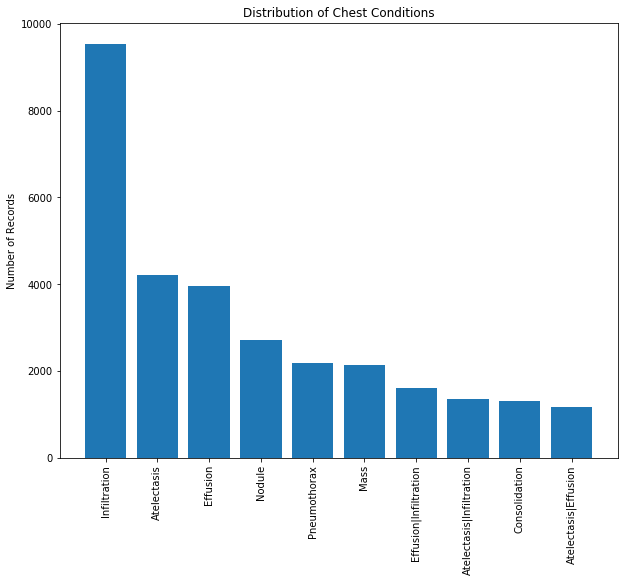

# Diagnosis of Chest Conditions with CNN

### Problem Statement 

The diagnosis of chest conditions typically requires the use of medical imaging techniques like
computed tomography (CT) or X-ray scans. CT scans are favored over X-ray scans because of
their ability to produce high-fidelity 3D images with multiple X-ray scans from various angles.
However, cost differences between the two techniques are significant. CT scans are approximately 10x the cost of X-ray scans.  This project seeks solutions to accurately diagnose chest conditions based on lower-cost X-rays.  

The National Institute of Health's (NIH) chest X-rays dataset will be used, which consists of more than 100k labeled chest X-ray images.  Deep learning techniques like traditional (densely connected) and convolutional neural networks will be explored. 


## Preliminaries


```python
import numpy as np
import pandas as pd

import os
import glob
import random
import itertools

import matplotlib.pyplot as plt
import seaborn as sb

import keras
import tensorflow as tf
from keras.preprocessing.image import ImageDataGenerator
from sklearn.model_selection import train_test_split

import scipy
from scipy.interpolate import interp1d

from sklearn.manifold import TSNE
from sklearn.metrics import roc_curve, auc
```

## Exploratory Data Analysis + Data Cleaning


```python
# Read in data labels
raw_data = pd.read_csv('data/Data_Entry_2017.csv')
data_labels = raw_data.copy()
```


```python
data_labels.head()
```


<div>
<style scoped>
    .dataframe tbody tr th:only-of-type {
        vertical-align: middle;
    }

    .dataframe tbody tr th {
        vertical-align: top;
    }

    .dataframe thead th {
        text-align: right;
    }
</style>
<table border="1" class="dataframe">
  <thead>
    <tr style="text-align: right;">
      <th></th>
      <th>Image Index</th>
      <th>Finding Labels</th>
      <th>Follow-up #</th>
      <th>Patient ID</th>
      <th>Patient Age</th>
      <th>Patient Gender</th>
      <th>View Position</th>
      <th>OriginalImage[Width</th>
      <th>Height]</th>
      <th>OriginalImagePixelSpacing[x</th>
      <th>y]</th>
      <th>Unnamed: 11</th>
    </tr>
  </thead>
  <tbody>
    <tr>
      <td>0</td>
      <td>00000001_000.png</td>
      <td>Cardiomegaly</td>
      <td>0</td>
      <td>1</td>
      <td>58</td>
      <td>M</td>
      <td>PA</td>
      <td>2682</td>
      <td>2749</td>
      <td>0.143</td>
      <td>0.143</td>
      <td>NaN</td>
    </tr>
    <tr>
      <td>1</td>
      <td>00000001_001.png</td>
      <td>Cardiomegaly|Emphysema</td>
      <td>1</td>
      <td>1</td>
      <td>58</td>
      <td>M</td>
      <td>PA</td>
      <td>2894</td>
      <td>2729</td>
      <td>0.143</td>
      <td>0.143</td>
      <td>NaN</td>
    </tr>
    <tr>
      <td>2</td>
      <td>00000001_002.png</td>
      <td>Cardiomegaly|Effusion</td>
      <td>2</td>
      <td>1</td>
      <td>58</td>
      <td>M</td>
      <td>PA</td>
      <td>2500</td>
      <td>2048</td>
      <td>0.168</td>
      <td>0.168</td>
      <td>NaN</td>
    </tr>
    <tr>
      <td>3</td>
      <td>00000002_000.png</td>
      <td>No Finding</td>
      <td>0</td>
      <td>2</td>
      <td>81</td>
      <td>M</td>
      <td>PA</td>
      <td>2500</td>
      <td>2048</td>
      <td>0.171</td>
      <td>0.171</td>
      <td>NaN</td>
    </tr>
    <tr>
      <td>4</td>
      <td>00000003_000.png</td>
      <td>Hernia</td>
      <td>0</td>
      <td>3</td>
      <td>81</td>
      <td>F</td>
      <td>PA</td>
      <td>2582</td>
      <td>2991</td>
      <td>0.143</td>
      <td>0.143</td>
      <td>NaN</td>
    </tr>
  </tbody>
</table>
</div>


```python
data_labels.describe()

# Observe the presence of outliers in patient age.  Remove records with patient ages of over 120
data_labels = data_labels[data_labels['Patient Age'] <= 120]
```


```python
data_labels.info()
```

    <class 'pandas.core.frame.DataFrame'>
    Int64Index: 112104 entries, 0 to 112119
    Data columns (total 12 columns):
    Image Index                    112104 non-null object
    Finding Labels                 112104 non-null object
    Follow-up #                    112104 non-null int64
    Patient ID                     112104 non-null int64
    Patient Age                    112104 non-null int64
    Patient Gender                 112104 non-null object
    View Position                  112104 non-null object
    OriginalImage[Width            112104 non-null int64
    Height]                        112104 non-null int64
    OriginalImagePixelSpacing[x    112104 non-null float64
    y]                             112104 non-null float64
    Unnamed: 11                    0 non-null float64
    dtypes: float64(3), int64(5), object(4)
    memory usage: 11.1+ MB
    


```python
# Determine list of all possible chest conditions
def get_conditions(df):
    conditions = df['Finding Labels'].map(lambda x: x.split('|')).tolist()
    conditions = list(itertools.chain(*conditions))
    conditions = np.unique(conditions)
    return(conditions)

all_conditions = get_conditions(data_labels)
all_conditions
```


    array(['Atelectasis', 'Cardiomegaly', 'Consolidation', 'Edema',
           'Effusion', 'Emphysema', 'Fibrosis', 'Hernia', 'Infiltration',
           'Mass', 'No Finding', 'Nodule', 'Pleural_Thickening', 'Pneumonia',
           'Pneumothorax'], dtype='<U18')


```python
# Perform one-hot encoding for conditions
def oh_encode(df, conditions):
    for condition in conditions:
        df[condition] = df['Finding Labels'].map(lambda x: 1 if condition in x else 0)
    return None

oh_encode(data_labels, all_conditions)
```


```python
data_labels.head()
```


<div>
<style scoped>
    .dataframe tbody tr th:only-of-type {
        vertical-align: middle;
    }

    .dataframe tbody tr th {
        vertical-align: top;
    }

    .dataframe thead th {
        text-align: right;
    }
</style>
<table border="1" class="dataframe">
  <thead>
    <tr style="text-align: right;">
      <th></th>
      <th>Image Index</th>
      <th>Finding Labels</th>
      <th>Follow-up #</th>
      <th>Patient ID</th>
      <th>Patient Age</th>
      <th>Patient Gender</th>
      <th>View Position</th>
      <th>OriginalImage[Width</th>
      <th>Height]</th>
      <th>OriginalImagePixelSpacing[x</th>
      <th>...</th>
      <th>Emphysema</th>
      <th>Fibrosis</th>
      <th>Hernia</th>
      <th>Infiltration</th>
      <th>Mass</th>
      <th>No Finding</th>
      <th>Nodule</th>
      <th>Pleural_Thickening</th>
      <th>Pneumonia</th>
      <th>Pneumothorax</th>
    </tr>
  </thead>
  <tbody>
    <tr>
      <td>0</td>
      <td>00000001_000.png</td>
      <td>Cardiomegaly</td>
      <td>0</td>
      <td>1</td>
      <td>58</td>
      <td>M</td>
      <td>PA</td>
      <td>2682</td>
      <td>2749</td>
      <td>0.143</td>
      <td>...</td>
      <td>0</td>
      <td>0</td>
      <td>0</td>
      <td>0</td>
      <td>0</td>
      <td>0</td>
      <td>0</td>
      <td>0</td>
      <td>0</td>
      <td>0</td>
    </tr>
    <tr>
      <td>1</td>
      <td>00000001_001.png</td>
      <td>Cardiomegaly|Emphysema</td>
      <td>1</td>
      <td>1</td>
      <td>58</td>
      <td>M</td>
      <td>PA</td>
      <td>2894</td>
      <td>2729</td>
      <td>0.143</td>
      <td>...</td>
      <td>1</td>
      <td>0</td>
      <td>0</td>
      <td>0</td>
      <td>0</td>
      <td>0</td>
      <td>0</td>
      <td>0</td>
      <td>0</td>
      <td>0</td>
    </tr>
    <tr>
      <td>2</td>
      <td>00000001_002.png</td>
      <td>Cardiomegaly|Effusion</td>
      <td>2</td>
      <td>1</td>
      <td>58</td>
      <td>M</td>
      <td>PA</td>
      <td>2500</td>
      <td>2048</td>
      <td>0.168</td>
      <td>...</td>
      <td>0</td>
      <td>0</td>
      <td>0</td>
      <td>0</td>
      <td>0</td>
      <td>0</td>
      <td>0</td>
      <td>0</td>
      <td>0</td>
      <td>0</td>
    </tr>
    <tr>
      <td>3</td>
      <td>00000002_000.png</td>
      <td>No Finding</td>
      <td>0</td>
      <td>2</td>
      <td>81</td>
      <td>M</td>
      <td>PA</td>
      <td>2500</td>
      <td>2048</td>
      <td>0.171</td>
      <td>...</td>
      <td>0</td>
      <td>0</td>
      <td>0</td>
      <td>0</td>
      <td>0</td>
      <td>1</td>
      <td>0</td>
      <td>0</td>
      <td>0</td>
      <td>0</td>
    </tr>
    <tr>
      <td>4</td>
      <td>00000003_000.png</td>
      <td>Hernia</td>
      <td>0</td>
      <td>3</td>
      <td>81</td>
      <td>F</td>
      <td>PA</td>
      <td>2582</td>
      <td>2991</td>
      <td>0.143</td>
      <td>...</td>
      <td>0</td>
      <td>0</td>
      <td>1</td>
      <td>0</td>
      <td>0</td>
      <td>0</td>
      <td>0</td>
      <td>0</td>
      <td>0</td>
      <td>0</td>
    </tr>
  </tbody>
</table>
<p>5 rows × 27 columns</p>
</div>


```python
# Evaluate distribution of conditions.  Observe a highly imbalanced dataset.  Remove records with 'No Finding' label
data_labels = data_labels[data_labels['No Finding']==0]

def show_dist(df, colname, n):
    counts = df[colname].value_counts()[:n]
    
    x_val = range(n)
    fig, ax = plt.subplots(1, 1, figsize=(10,8))
    ax.bar(x_val, counts)
    ax.set_xticks(x_val)
    ax.set_xticklabels(counts.index, rotation=90)
    plt.title('Distribution of Chest Conditions')
    plt.ylabel('Number of Records')
    return None

show_dist(data_labels, 'Finding Labels', 10)
```





```python
# Drop 'No Finding' column--no longer relevant
data_labels.drop(labels=['No Finding'], axis=1, inplace=True)
data_labels.info()
```

    <class 'pandas.core.frame.DataFrame'>
    Int64Index: 51751 entries, 0 to 112115
    Data columns (total 26 columns):
    Image Index                    51751 non-null object
    Finding Labels                 51751 non-null object
    Follow-up #                    51751 non-null int64
    Patient ID                     51751 non-null int64
    Patient Age                    51751 non-null int64
    Patient Gender                 51751 non-null object
    View Position                  51751 non-null object
    OriginalImage[Width            51751 non-null int64
    Height]                        51751 non-null int64
    OriginalImagePixelSpacing[x    51751 non-null float64
    y]                             51751 non-null float64
    Unnamed: 11                    0 non-null float64
    Atelectasis                    51751 non-null int64
    Cardiomegaly                   51751 non-null int64
    Consolidation                  51751 non-null int64
    Edema                          51751 non-null int64
    Effusion                       51751 non-null int64
    Emphysema                      51751 non-null int64
    Fibrosis                       51751 non-null int64
    Hernia                         51751 non-null int64
    Infiltration                   51751 non-null int64
    Mass                           51751 non-null int64
    Nodule                         51751 non-null int64
    Pleural_Thickening             51751 non-null int64
    Pneumonia                      51751 non-null int64
    Pneumothorax                   51751 non-null int64
    dtypes: float64(3), int64(19), object(4)
    memory usage: 10.7+ MB
    


```python
all_conditions = get_conditions(data_labels)
all_conditions
```


    array(['Atelectasis', 'Cardiomegaly', 'Consolidation', 'Edema',
           'Effusion', 'Emphysema', 'Fibrosis', 'Hernia', 'Infiltration',
           'Mass', 'Nodule', 'Pleural_Thickening', 'Pneumonia',
           'Pneumothorax'], dtype='<U18')


```python
data_labels['conditions'] = data_labels[all_conditions].values.tolist()
```

## Data Preparation


```python
# Create mapping from image names to file paths
path_pattern = os.path.join('data', 'images_*', 'images', '*.png')
img_path_list = glob.glob(path_pattern)
img_path_dict = {os.path.basename(img_path): img_path for img_path in img_path_list}
```


```python
# Add image path for each record in dataset
data_labels['img_path'] = data_labels['Image Index'].map(lambda img_name: img_path_dict[img_name])
```


```python
# Split data into training, validation, and test sets
train_data, test_data = train_test_split(data_labels, test_size=0.1, shuffle=True,
                                        stratify = data_labels['Finding Labels'].map(lambda x: x[:3]))
```


```python
train_data, val_data = train_test_split(train_data, test_size=0.2, shuffle=True,
                                       stratify = train_data['Finding Labels'].map(lambda x: x[:3]))
```


```python
print('Train data dimensions:', train_data.shape)
print('Validation data dimensions:', val_data.shape)
print('Test data dimensions:', test_data.shape)
```

    Train data dimensions: (37260, 28)
    Validation data dimensions: (9315, 28)
    Test data dimensions: (5176, 28)
    

### Data Generator Setup 


```python
# Create data generator to read images in batches
all_conditions = list(all_conditions)
IMG_SIZE=(256, 256)
datagen = ImageDataGenerator()

train_datagen = datagen.flow_from_dataframe(train_data,
                                           x_col='img_path',
                                           y_col=all_conditions,
                                           target_size=IMG_SIZE,
                                           class_mode='raw', 
                                           batch_size=32)

val_datagen = datagen.flow_from_dataframe(val_data,
                                          x_col='img_path',
                                          y_col=all_conditions,
                                          target_size=IMG_SIZE,
                                          class_mode='raw',
                                          batch_size=64)

test_datagen = datagen.flow_from_dataframe(test_data,
                                           x_col='img_path',
                                           y_col=all_conditions,
                                           target_size=IMG_SIZE,
                                           class_mode='raw',
                                           batch_size=1024)


```

    Found 37260 validated image filenames.
    Found 9315 validated image filenames.
    Found 5176 validated image filenames.
    


```python
# Visualize first batch of images
train_batch = next(train_datagen)[:9]

fig, axs = plt.subplots(3,3, figsize=(16,16))
axs = axs.flatten()

for (img_x, img_y, img_ax) in zip(train_x, train_y, axs):
    img_ax.imshow(img_x[:,:,0], cmap='Greys')
    img_x_labels = ' + '.join([cond for cond, label in zip(all_conditions, img_y) if label==1])
    img_ax.set_title(img_x_labels)
    img_ax.axis('off')

```


## Build Models 

### CNN 


```python
# Define optimizer
opt = keras.optimizers.adam_v2.Adam(learning_rate=0.001)
topk = keras.metrics.TopKCategoricalAccuracy(k=5)
```


```python
model = keras.models.Sequential()
model.add(keras.layers.Conv2D(32, (3,3), activation='relu', padding='same', 
                                input_shape=(train_x.shape[1:])))
model.add(keras.layers.MaxPool2D((2,2), strides=2))
model.add(keras.layers.Conv2D(64, (3,3), activation='relu', padding='same'))
model.add(keras.layers.MaxPool2D((2,2), strides=2))
model.add(keras.layers.Conv2D(128, (3,3), activation='relu', padding='same'))
model.add(keras.layers.MaxPool2D((2,2), strides=2))
model.add(keras.layers.Conv2D(256, (3,3), activation='relu', padding='same'))
model.add(keras.layers.MaxPool2D((2,2), strides=2))
model.add(keras.layers.Flatten())
model.add(keras.layers.Dense(len(all_conditions), activation='sigmoid'))
print(model.summary())

```

    Model: "sequential_12"
    _________________________________________________________________
    Layer (type)                 Output Shape              Param #   
    =================================================================
    conv2d_46 (Conv2D)           (None, 256, 256, 32)      896       
    _________________________________________________________________
    max_pooling2d_46 (MaxPooling (None, 128, 128, 32)      0         
    _________________________________________________________________
    conv2d_47 (Conv2D)           (None, 128, 128, 64)      18496     
    _________________________________________________________________
    max_pooling2d_47 (MaxPooling (None, 64, 64, 64)        0         
    _________________________________________________________________
    conv2d_48 (Conv2D)           (None, 64, 64, 128)       73856     
    _________________________________________________________________
    max_pooling2d_48 (MaxPooling (None, 32, 32, 128)       0         
    _________________________________________________________________
    conv2d_49 (Conv2D)           (None, 32, 32, 256)       295168    
    _________________________________________________________________
    max_pooling2d_49 (MaxPooling (None, 16, 16, 256)       0         
    _________________________________________________________________
    flatten_11 (Flatten)         (None, 65536)             0         
    _________________________________________________________________
    dense_12 (Dense)             (None, 14)                917518    
    =================================================================
    Total params: 1,305,934
    Trainable params: 1,305,934
    Non-trainable params: 0
    _________________________________________________________________
    None
    


```python
model.compile(optimizer=opt, loss='binary_crossentropy', metrics=[topk])
```


```python
# Run for 2 epochs to conserve computing resources
history = model.fit(train_datagen, 
                    steps_per_epoch=100,
                    validation_steps=50,
                    validation_data=val_datagen, 
                    epochs=2)
```

    Epoch 1/2
    100/100 [==============================] - 188s 2s/step - loss: 6.7952 - top_k_categorical_accuracy: 0.6546 - val_loss: 0.3059 - val_top_k_categorical_accuracy: 0.7350
    Epoch 2/2
    100/100 [==============================] - 186s 2s/step - loss: 0.3024 - top_k_categorical_accuracy: 0.7387 - val_loss: 0.3062 - val_top_k_categorical_accuracy: 0.7359
    


```python
test_x, test_y = next(test_datagen)
```

## Model Evaluation 


```python
# Predict model 
y_pred = model.predict(test_x)
```


```python
y_pred[:5]
```


    array([[0.20166901, 0.07214871, 0.05906156, 0.02727956, 0.30680323,
            0.01325548, 0.06997937, 0.0037351 , 0.25562257, 0.20107701,
            0.12394708, 0.10428512, 0.01202098, 0.14555046],
           [0.24328488, 0.10327926, 0.08492112, 0.0667983 , 0.33003476,
            0.0241212 , 0.02279302, 0.0064249 , 0.33249992, 0.10642788,
            0.09942654, 0.05880937, 0.02358162, 0.06386936],
           [0.25620204, 0.05903396, 0.10174575, 0.04916012, 0.24418822,
            0.06929016, 0.0540528 , 0.01102525, 0.32861528, 0.19259602,
            0.17040068, 0.09244871, 0.03352752, 0.08919248],
           [0.17195037, 0.03534457, 0.14248595, 0.04134786, 0.28238672,
            0.05141163, 0.01547927, 0.00231597, 0.3844045 , 0.11465839,
            0.11554116, 0.06628197, 0.01883331, 0.04506251],
           [0.29151464, 0.06840333, 0.08437636, 0.04442558, 0.2645261 ,
            0.06935498, 0.04514971, 0.00934643, 0.36389688, 0.1545091 ,
            0.14699984, 0.09233651, 0.03074557, 0.09404346]], dtype=float32)


```python
x = range(len(all_conditions))

# Proportion of conditions predicted by model
pred_prop = np.mean(y_pred, axis=0)

# Actual proportion of conditions in test data
actual_prop = np.mean(test_y, axis=0)


```


```python
# Smooth distribution curve 
x_new = np.arange(0, len(all_conditions) - 1, 0.1)

interp_pred = interp1d(x, pred_prop, kind=2)
interp_actual = interp1d(x, actual_prop, kind=2)

pred_prop_interp = interp_pred(x_new)
actual_prop_interp = interp_actual(x_new)
```


```python
# Plot distributions
fig, ax = plt.subplots(1, 1, figsize=(12,8))

ax.plot(x_new, pred_prop_interp, c='blue', label='Predicted')
ax.plot(x_new, actual_prop_interp, c='purple', label='Actual')
ax.set_title('Proportions of Chest Conditions - Predicted versus Actual')
ax.set_xticks(range(len(all_conditions)))
ax.set_xticklabels(all_conditions, rotation=90)
ax.legend()
plt.show()
```


## Retrospective - Observed Challenges and Potential Improvements 

Observed challenges:
* Multilabel classification metrics - metrics that accurately represent performance in multilabel classification problems are difficult to derive and implement.  Each patient (and hence X-ray) may have multiple conditions, so there will often be scenarios of partial correctness where most but not all of the true and predicted labels match. 
* Labeling accuracy - Labels are extracted from physician notes via NLP methods and may not be entirely accurate.
* Computing resource limitations - CNNs require large amounts of RAM and processing power to run efficiently.  Training iterations (i.e., epochs) were constrained.

Areas for additional improvement/exploration:
* Add new relevant features to model - X-ray image data can be supplemented by factors like patient age, gender, and medical history in predicting patient conditions.
* Resampling to mitigate class imbalance - Because of the rarity of some conditions (e.g., hernia), the dataset is very imbalanced and can result in training issues.  The data can be resampled to increase weights of rare conditions and decrease weights of common conditions.


```python

```
